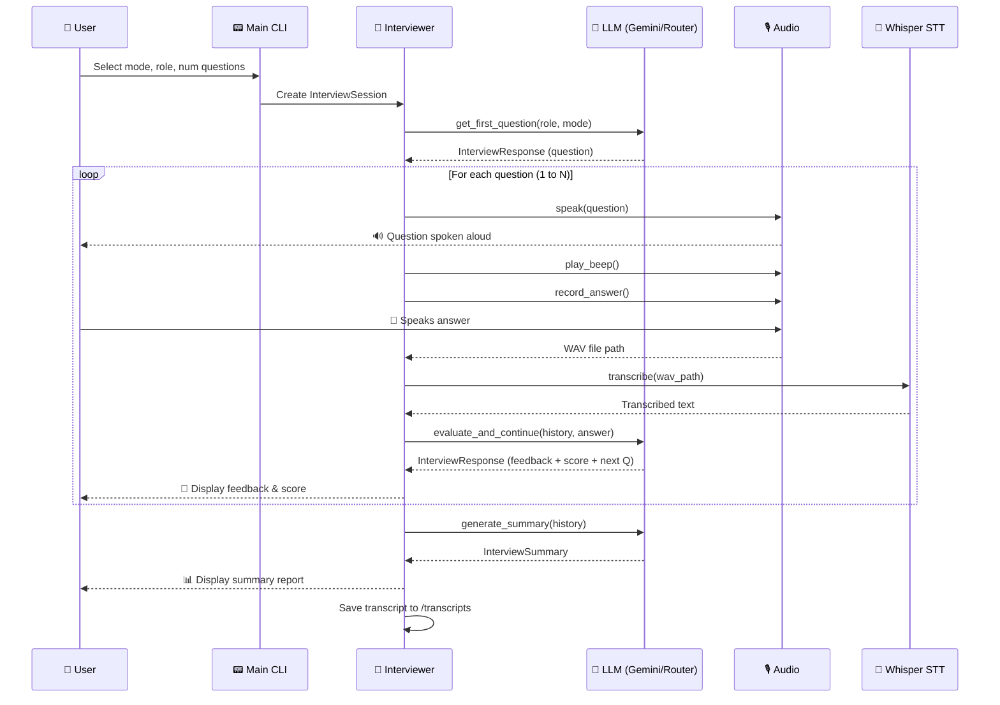

<div align="center">

# 🎤 AI Mock Interview Agent

**A real-time, voice-powered mock interview system that listens, evaluates, and coaches you — all from the terminal.**

Built with **Google Gemini 2.5 Flash** · **OpenAI Whisper** · **pyttsx3 TTS**

[](https://www.python.org/)
[](https://ai.google.dev/)
[](https://github.com/openai/whisper)
[](LICENSE)

---

*Practice for your next tech interview with an AI interviewer that speaks questions aloud, listens to your verbal answers, provides real-time feedback with scores, and generates a comprehensive performance report at the end.*

</div>

---

## 📋 Table of Contents

- [Features](#-features)
- [Demo](#-demo)
- [Tech Stack](#-tech-stack)
- [Architecture](#-architecture)
- [Prerequisites](#-prerequisites)
- [Installation & Setup](#-installation--setup)
- [Usage](#-usage)
- [Configuration](#%EF%B8%8F-configuration)
- [Project Structure](#-project-structure)
- [How It Works](#-how-it-works)
- [Troubleshooting](#-troubleshooting)
- [Contributing](#-contributing)
- [License](#-license)

---

## ✨ Features

| Feature | Description |
|---|---|
| 🎙️ **Voice Input** | Speak your answers naturally — Whisper transcribes in real-time |
| 🔊 **Voice Output** | Questions are read aloud using system text-to-speech |
| 🧠 **AI-Powered Evaluation** | Gemini 2.5 Flash scores and critiques every answer (0–10) |
| 📊 **Summary Report** | Get a full performance breakdown — strengths, weaknesses, tips |
| 📝 **Transcript Saving** | Every session is auto-saved as a Markdown file |
| 🔄 **Auto-Failover** | Seamlessly switches to OpenRouter (Gemma 4 26B) if Gemini is unavailable |
| 🎯 **Multiple Modes** | Technical, HR & Behavioral, DSA & Problem Solving, System Design |
| ⚡ **Adaptive Difficulty** | Questions get progressively harder based on your performance |
| 🔇 **Smart Silence Detection** | Automatically stops recording when you stop speaking |

---

## 🎬 Demo

```
  ╭─────────────────────────────────────────╮
  │   🎤  AI Mock Interview Agent  🎤       │
  │         Powered by Gemini + Whisper     │
  ╰─────────────────────────────────────────╯

  What would you like to do?

    [1]  Start Interview
    [2]  View Settings
    [3]  Exit

  Choose [1]: 1

  ┌────┬───────────────────────┬──────────────────────────────────────────────┐
  │ #  │ Mode                  │ Description                                  │
  ├────┼───────────────────────┼──────────────────────────────────────────────┤
  │ 1  │ Technical             │ Language/framework-specific technical Qs      │
  │ 2  │ HR & Behavioral       │ Behavioral, situational, culture-fit Qs       │
  │ 3  │ DSA & Problem Solving │ Data structures, algorithms, coding problems  │
  │ 4  │ System Design         │ Architecture, scalability, design trade-offs  │
  └────┴───────────────────────┴──────────────────────────────────────────────┘

  Select mode [1-4]: 1
  Enter the target role: Backend Engineer
  Number of questions [5]: 3
  Ready? [y/n] [y]: y

  ─────────────── 🎤 Mock Interview Starting ───────────────

  ╭─── ❓ Question 1/3 ─────────────────────────────────────╮
  │  Can you explain the difference between REST and        │
  │  GraphQL? When would you choose one over the other?     │
  ╰─────────────────────────────────────────────────────────╯

  🎙️  Listening… (speak now, silence will stop recording)
  ✅  Recorded 15.2s of audio.
  🔄  Transcribing…
  📝  You said: REST is a stateless architecture pattern...

  ╭─── 💬 Feedback ─────────────────────────────────────────╮
  │  Score: 7/10                                            │
  │                                                         │
  │  Good overview of REST vs GraphQL trade-offs. You       │
  │  correctly identified...                                │
  ╰─────────────────────────────────────────────────────────╯
```

---

## 🛠️ Tech Stack

### Core Technologies

| Technology | Purpose | Why |
|---|---|---|
| **[Python 3.10+](https://www.python.org/)** | Runtime | Async I/O, type hints, modern syntax |
| **[Google Gemini 2.5 Flash](https://ai.google.dev/)** | LLM (Primary) | Fast structured JSON output, free tier |
| **[OpenAI Whisper](https://github.com/openai/whisper)** | Speech-to-Text | Offline, accurate, multilingual |
| **[pyttsx3](https://pyttsx3.readthedocs.io/)** | Text-to-Speech | Offline, cross-platform, SAPI5 on Windows |
| **[Pydantic v2](https://docs.pydantic.dev/)** | Schema Validation | Enforces structured LLM responses |

### Supporting Libraries

| Library | Purpose |
|---|---|
| **[Rich](https://rich.readthedocs.io/)** | Beautiful terminal UI — panels, tables, progress bars |
| **[SoundDevice](https://python-sounddevice.readthedocs.io/)** | Real-time microphone audio capture |
| **[SciPy](https://scipy.org/)** | WAV file I/O |
| **[NumPy](https://numpy.org/)** | Audio signal processing (RMS silence detection) |
| **[python-dotenv](https://pypi.org/project/python-dotenv/)** | Environment variable management |
| **[Requests](https://requests.readthedocs.io/)** | OpenRouter fallback API calls |

### Fallback LLM

| Provider | Model | When |
|---|---|---|
| **[OpenRouter](https://openrouter.ai/)** | Gemma 4 26B (free) | Auto-activates when Gemini is unavailable |

---

## 🏗️ Architecture

```
┌──────────────┐     ┌──────────────┐     ┌──────────────────┐
│   main.py    │────▶│ interviewer  │────▶│     llm.py       │
│  (CLI Menu)  │     │   .py        │     │  (Gemini/Router) │
│              │     │ (Orchestrator│     │                  │
│  • Mode pick │     │  Loop)       │     │  • Structured    │
│  • Role pick │     │              │     │    JSON output   │
│  • Num Qs    │     │  • Q&A loop  │     │  • Retry logic   │
│  • Settings  │     │  • History   │     │  • Auto failover │
└──────────────┘     │  • Scoring   │     └──────────────────┘
                     └──────┬───────┘
                            │
              ┌─────────────┼─────────────┐
              ▼             ▼             ▼
       ┌────────────┐ ┌──────────┐ ┌───────────┐
       │  audio.py  │ │  stt.py  │ │ utils.py  │
       │            │ │          │ │           │
       │ • Record   │ │ • Whisper│ │ • Save    │
       │ • TTS      │ │   model  │ │   transcript│
       │ • Beep     │ │ • Trans- │ │ • Format  │
       │ • Silence  │ │   cribe  │ │   reports │
       │   detect   │ │          │ │ • Print   │
       └────────────┘ └──────────┘ │   feedback│
                                   └───────────┘
```

---

## 📦 Prerequisites

Before you begin, ensure you have the following installed:

| Requirement | Minimum Version | How to Get It |
|---|---|---|
| **Python** | 3.10+ | [python.org/downloads](https://www.python.org/downloads/) |
| **FFmpeg** | Any recent | Required by Whisper — see [Step 1](#step-1-install-ffmpeg) |
| **Microphone** | — | Any USB or built-in microphone |
| **Gemini API Key** | — | Free at [AI Studio](https://aistudio.google.com/apikey) |
| **OpenRouter API Key** *(optional)* | — | Free at [openrouter.ai](https://openrouter.ai/) — enables fallback |

---

## 🚀 Installation & Setup

### Step 1: Install FFmpeg

FFmpeg is required by Whisper to process audio files.

<details>
<summary><b>Windows</b></summary>

```powershell
# Option A: winget (recommended)
winget install --id Gyan.FFmpeg

# Option B: Chocolatey
choco install ffmpeg

# Option C: Scoop
scoop install ffmpeg
```

</details>

<details>
<summary><b>macOS</b></summary>

```bash
brew install ffmpeg
```

</details>

<details>
<summary><b>Linux (Ubuntu/Debian)</b></summary>

```bash
sudo apt update && sudo apt install ffmpeg
```

</details>

Verify the installation:

```bash
ffmpeg -version
```

> **💡 Tip:** If the command isn't found, restart your terminal or add FFmpeg's `bin` folder to your system PATH.

---

### Step 2: Clone the Repository

```bash
git clone https://github.com/Debajeet-1411/MOCK-INTERVIEW-AGENT.git
cd MOCK-INTERVIEW-AGENT
```

---

### Step 3: Create a Virtual Environment

```bash
# Create the virtual environment
python -m venv venv

# Activate it
# Windows (PowerShell):
.\venv\Scripts\Activate.ps1

# Windows (CMD):
.\venv\Scripts\activate.bat

# macOS / Linux:
source venv/bin/activate
```

---

### Step 4: Install Dependencies

```bash
pip install -r requirements.txt
```

> **📝 Note:** On first run, Whisper will automatically download the `base` model (~140 MB). This is a one-time download.

<details>
<summary><b>🚀 Optional: GPU Acceleration (NVIDIA)</b></summary>

If you have an NVIDIA GPU and want faster transcription, install PyTorch with CUDA support:

```bash
pip install torch torchvision torchaudio --index-url https://download.pytorch.org/whl/cu121
```

</details>

---

### Step 5: Set Up API Keys

1. **Get a Gemini API key** (free): [https://aistudio.google.com/apikey](https://aistudio.google.com/apikey)
2. *(Optional)* **Get an OpenRouter API key** (free): [https://openrouter.ai/](https://openrouter.ai/)
3. Create a `.env` file in the project root:

```env
GEMINI_API_KEY=your_gemini_api_key_here
OPEN_ROUTER_API=your_openrouter_api_key_here
```

> **⚠️ Important:** Never commit your `.env` file. It is already listed in `.gitignore`.

---

### Step 6: Run the Application

```bash
python main.py
```

🎉 **You're all set!** The interactive CLI menu will appear.

---

## 🎮 Usage

### Starting an Interview

1. Run `python main.py`
2. Select **[1] Start Interview** from the menu
3. Choose an **interview mode**:
   - `1` — **Technical** → Language/framework-specific questions
   - `2` — **HR & Behavioral** → Situational, culture-fit questions
   - `3` — **DSA & Problem Solving** → Algorithms, data structures, coding
   - `4` — **System Design** → Architecture, scalability, trade-offs
4. Enter the **target role** (e.g., "Backend Engineer", "React Developer")
5. Choose the **number of questions** (1–20, default: 5)
6. Confirm and start!

### During the Interview

| Action | What Happens |
|---|---|
| **🔔 Beep sound** | Signals that the mic is now recording |
| **🎙️ Speak your answer** | Talk naturally into your microphone |
| **🔇 Stop speaking** | After 2 seconds of silence, recording stops automatically |
| **📝 Transcription** | Whisper converts your speech to text |
| **💬 Feedback** | AI evaluates your answer and gives a score + critique |
| **➡️ Next question** | The interviewer asks the next (harder) question |

### After the Interview

- A **summary report** is displayed with:
  - ✅ Strengths
  - ⚠️ Weaknesses
  - 💡 Improvement tips
  - 📊 Overall score (0–10)
- The full **transcript** is saved as a Markdown file in the `transcripts/` folder
- The overall feedback is **spoken aloud** by the TTS engine

### Keyboard Shortcuts

| Key | Action |
|---|---|
| `Ctrl+C` | Interrupt the interview (partial transcript is saved) |

---

## ⚙️ Configuration

All settings are centralized in [`config.py`](config.py). You can modify them to tune the experience:

### LLM Settings

| Setting | Default | Description |
|---|---|---|
| `GEMINI_MODEL` | `gemini-2.5-flash` | Primary Gemini model |
| `OPEN_ROUTER_MODEL` | `google/gemma-4-26b-a4b-it:free` | Fallback model via OpenRouter |
| `MAX_RETRIES` | `3` | Retry attempts before failing over |
| `RETRY_BASE_DELAY` | `1.0s` | Exponential backoff base delay |

### Audio Settings

| Setting | Default | Description |
|---|---|---|
| `SAMPLE_RATE` | `16000` Hz | Optimal for Whisper |
| `SILENCE_THRESHOLD` | `0.01` | RMS amplitude — lower = more sensitive |
| `SILENCE_DURATION` | `2.0s` | Seconds of silence before auto-stop |
| `MAX_RECORD_SECONDS` | `120s` | Hard cap for a single recording |

### TTS Settings

| Setting | Default | Description |
|---|---|---|
| `TTS_RATE` | `160` wpm | Speech speed |
| `TTS_VOLUME` | `1.0` | Volume (0.0 – 1.0) |

### Whisper Settings

| Setting | Default | Description |
|---|---|---|
| `WHISPER_MODEL` | `base` | Model size: `tiny` / `base` / `small` / `medium` / `large` |

> **💡 Tip:** Use `tiny` for faster transcription on CPU, or `medium`/`large` for better accuracy.

### Interview Settings

| Setting | Default | Description |
|---|---|---|
| `NUM_QUESTIONS` | `5` | Default questions per session (overridable at runtime) |

---

## 📁 Project Structure

```
MOCK-INTERVIEW-AGENT/
│
├── main.py              # CLI entry point — menu, mode selection, preflight checks
├── interviewer.py       # Interview session orchestrator — Q&A loop, scoring
├── llm.py               # LLM integration — Gemini primary, OpenRouter fallback
├── stt.py               # Speech-to-Text — Whisper model loading & transcription
├── audio.py             # Audio — mic recording, silence detection, TTS, beep
├── config.py            # Centralized configuration & environment loading
├── utils.py             # Utilities — transcript saving, report formatting
│
├── requirements.txt     # Python dependencies
├── setup_guide.md       # Detailed setup walkthrough
├── .env                 # API keys (not committed)
├── .gitignore           # Git ignore rules
│
└── transcripts/         # Auto-generated interview transcripts (Markdown)
    ├── interview_backend_engineer_20260424_140602.md
    └── ...
```

---

## 🔄 How It Works



### Failover Flow

1. **Gemini** is the primary LLM — fast, structured JSON output
2. If Gemini fails after **3 retry attempts** (exponential backoff), the system **automatically switches to OpenRouter**
3. Once switched, **all subsequent calls** in the session use OpenRouter (avoids repeated Gemini failures)
4. The switch is transparent — the interview continues without interruption

---

## 🔧 Troubleshooting

| Problem | Solution |
|---|---|
| **`No microphone detected`** | Check your mic is connected and unmuted. On Windows: **Settings → Privacy → Microphone** |
| **`GEMINI_API_KEY is not set`** | Create a `.env` file in the project root with your API key |
| **`FFmpeg not found`** | Reinstall FFmpeg and ensure it's on your system PATH. Restart terminal. |
| **`pyttsx3` error on Windows** | Run `pip install pypiwin32` to install the Windows COM bridge |
| **Whisper is slow** | Use a GPU (see Installation Step 4) or set `WHISPER_MODEL = "tiny"` in `config.py` |
| **Empty transcription** | Speak louder/closer to the mic, or lower `SILENCE_THRESHOLD` in `config.py` |
| **Gemini quota exceeded** | The system will auto-switch to OpenRouter. Or wait and retry later. |
| **OpenRouter also fails** | Check your `OPEN_ROUTER_API` key in `.env`, or try again later |
| **TTS speaks too fast/slow** | Adjust `TTS_RATE` in `config.py` (default: 160 wpm) |
| **Recording cuts off too early** | Increase `SILENCE_DURATION` in `config.py` (default: 2.0s) |

---

## 🤝 Contributing

Contributions are welcome! Here's how:

1. **Fork** the repository
2. **Create** a feature branch: `git checkout -b feature/my-feature`
3. **Commit** your changes: `git commit -m "Add my feature"`
4. **Push** to the branch: `git push origin feature/my-feature`
5. **Open** a Pull Request

---

## 📄 License

This project is open source and available under the [MIT License](LICENSE).

---

<div align="center">

**Built with ❤️ by [Debajeet](https://github.com/Debajeet-1411)**

⭐ Star this repo if you found it helpful!

</div>
